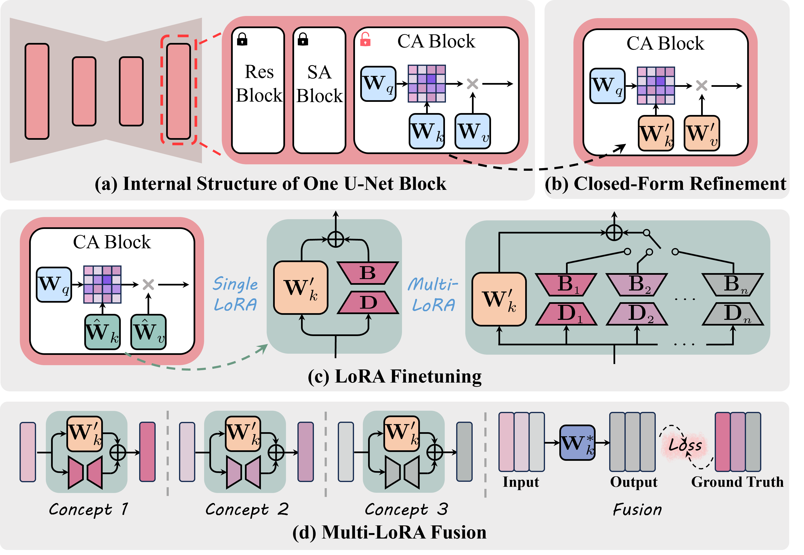

# [CVPR 2024] MACE: Mass Concept Erasure in Diffusion Models

<!-- ## [<a href="https://shilin-lu.github.io/tf-icon.github.io/" target="_blank">Project Page</a>] [<a href="https://entuedu-my.sharepoint.com/:b:/g/personal/shilin002_e_ntu_edu_sg/EWRDLuFDrs5Ll0KGuMtvtbUBhBZcSw2roKCo96iCWgpMZQ?e=rEv3As" target="_blank">Poster</a>] -->

[](https://arxiv.org/abs/2403.06135)

Official implementation of [MACE: Mass Concept Erasure in Diffusion Models](https://arxiv.org/abs/2403.06135).

> **MACE: Mass Concept Erasure in Diffusion Models**<br>
<!-- > [Gwanghyun Kim](https://gwang-kim.github.io/), Taesung Kwon, [Jong Chul Ye](https://bispl.weebly.com/professor.html) <br> -->
> Shilin Lu, Zilan Wang, Leyang Li, Yanzhu Liu, Adams Wai-Kin Kong <br>
> CVPR 2024
> 
>**Abstract**: <br>
The rapid expansion of large-scale text-to-image diffusion models has raised growing concerns regarding their potential misuse in creating harmful or misleading content. In this paper, we introduce MACE, a finetuning framework for the task of mass concept erasure. This task aims to prevent models from generating images that embody unwanted concepts when prompted. Existing concept erasure methods are typically restricted to handling fewer than five concepts simultaneously and struggle to find a balance between erasing concept synonyms (generality) and maintaining unrelated concepts (specificity). In contrast, MACE differs by successfully scaling the erasure scope up to 100 concepts and by achieving an effective balance between generality and specificity. This is achieved by leveraging closed-form cross-attention refinement along with LoRA finetuning, collectively eliminating the information of undesirable concepts. Furthermore, MACE integrates multiple LoRAs without mutual interference. We conduct extensive evaluations of MACE against prior methods across four different tasks: object erasure, celebrity erasure, explicit content erasure, and artistic style erasure. Our results reveal that MACE surpasses prior methods in all evaluated tasks.


---

</div>



(a) Our framework focuses on tuning the prompts-related projection matrices within cross-attention (CA) blocks. (b) The pretrained U-Net's CA blocks are refined using a closed-form solution, discouraging the model from embedding the residual information of the target phrase into surrounding words. (c) For each concept targeted for removal, a distinct LoRA module is learned to eliminate its intrinsic information. (d) A closed-form solution is introduced to integrate multiple LoRA modules without interfering with one another while averting catastrophic forgetting.

<!-- # Updates:

**19/06/23** 🧨 Diffusers implementation of Plug-and-Play is available [here](https://github.com/MichalGeyer/pnp-diffusers). -->

<!-- ## TODO:
- [ ] Diffusers support and pipeline integration
- [ ] Gradio demo
- [ ] Release TF-ICON Test Benchmark -->


<!-- ## Usage

**To plug-and-play diffusion features, please follow these steps:**

1. [Setup](#setup)
2. [Feature extraction](#feature-extraction)
3. [Running PnP](#running-pnp)
4. [TI2I Benchmarks](#ti2i-benchmarks) -->

---

</div>

## Contents
  - [Setup](#setup)
    - [Creating a Conda Environment](#creating-a-conda-environment)
    - [Install Grounded-SAM to Prepare Masks for LoRA Tuning](#install-grounded\-sam-to-prepare-masks-for-lora-tuning)
    - [Install Other Dependencies](#install-other-dependencies) 
  - [Data Preparation for Training MACE](#data-preparation-for-training-mace) 
  - [Training MACE to Erase Concepts](#training-mace-to-erase-concepts)
  - [Sampling from the Modified Model](#sampling-from-the-modified-model)
  - [MACE Finetuned Model Weights](#mace-finetuned-model-weights)
  - [Metrics Evaluation](#metrics-evaluation)
  - [Acknowledgments](#acknowledgments)
  - [Citation](#citation)


<br>

## Setup

### Creating a Conda Environment

```
git clone https://github.com/Shilin-LU/MACE.git
conda create -n mace python=3.10
conda activate mace
conda install pytorch==2.0.1 torchvision==0.15.2 pytorch-cuda=11.7 -c pytorch -c nvidia
```

### Install Grounded-SAM to Prepare Masks for LoRA Tuning

You have the option to utilize alternative segmentation models and bypass this section; however, be aware that performance might suffer if masks are not precise or not employed.

```
export AM_I_DOCKER=False
export BUILD_WITH_CUDA=True
# export CUDA_HOME=/path/to/cuda-11.7/

cd MACE
git clone https://github.com/IDEA-Research/Grounded-Segment-Anything.git
cd Grounded-Segment-Anything

# Install Segment Anything:
python -m pip install -e segment_anything

# Install Grounding DINO:
pip install --no-build-isolation -e GroundingDINO

# Install osx:
git submodule update --init --recursive
cd grounded-sam-osx && bash install.sh

# Install RAM & Tag2Text:
git clone https://github.com/xinyu1205/recognize-anything.git
pip install -r ./recognize-anything/requirements.txt
pip install -e ./recognize-anything/
```

Download the pretrained weights of Grounded-SAM.

```
cd ..    # cd Grounded-Segment-Anything

# Download the pretrained groundingdino-swin-tiny model:
wget https://github.com/IDEA-Research/GroundingDINO/releases/download/v0.1.0-alpha/groundingdino_swint_ogc.pth

# Download the pretrained SAM model:
wget https://huggingface.co/lkeab/hq-sam/resolve/main/sam_hq_vit_h.pth
```

### Install Other Dependencies

```
pip install diffusers==0.22.0 transformers==4.38.1
pip install accelerate openai omegaconf
```

## Data Preparation for Training MACE

To erase concepts, 8 images along with their respective segmentation masks should be generated for each concept. To prepare the data for your intended concept, configure your settings in `configs/object/ship.yaml` and execute the command:

```
CUDA_VISIBLE_DEVICES=0 python data_preparation.py configs/object/ship.yaml
```

Before beginning the mass concept erasing process, ensure that you have pre-cached the prior knowledge (e.g., MSCOCO) and domain-specific knowledge (e.g., certain celebrities, artistic styles, or objects) you wish to retain. 

- You can download our pre-cached files from [this OneDrive folder](https://entuedu-my.sharepoint.com/:f:/g/personal/shilin002_e_ntu_edu_sg/EiyepLM2qoFEh_kQ0kO4IzQBu6YZllxATJvv7ffguvFbBQ?e=v4JeyI). Once downloaded, place these files in the `./cache/` for use.

- Alternatively, to preserve additional knowledge of your choice, you can cache the information by modifying the script `src/cache_coco.py`.

## Training MACE to Erase Concepts

After preparing the data, you can specify your training parameters in the same configuration file `configs/object/ship.yaml` and run the following command:

```
CUDA_VISIBLE_DEVICES=0 python training.py configs/object/ship.yaml
```

## Sampling from the Finetuned Model

The finetuned model can be simply tested by running the following command to generate several images:

```
CUDA_VISIBLE_DEVICES=0 python inference.py \
          --num_images 3 \
          --prompt 'your_prompt' \
          --model_path /path/to/saved_model/LoRA_fusion_model \
          --save_path /path/to/save/folder
```

To produce lots of images based on a list of prompts with with predetermined seeds (e.g., from a CSV file `./prompts_csv/celebrity_100_concepts.csv`), execute the command below (the hyperparameter `step` should be set to the same value as `num_processes`):

```
CUDA_VISIBLE_DEVICES=0,1,2,3 accelerate launch \
          --multi_gpu --num_processes=4 --main_process_port 31372 \
          src/sample_images_from_csv.py \
          --prompts_path ./prompts_csv/celebrity_100_concepts.csv \
          --save_path /path/to/save/folder \
          --model_name /path/to/saved_model/LoRA_fusion_model \
          --step 4
```

## MACE Finetuned Model Weights

We provide several finetuned Stable Diffusion v1.4 with MACE.

| Concept Type to Erase | Finetuned Model |
|---|---|
| Object Erasure | [OneDrive link](https://entuedu-my.sharepoint.com/:f:/g/personal/shilin002_e_ntu_edu_sg/Ehz3tkQ2Y2tFuo7JIcD-17kBR1eqZvL5DXl7WH5aL25Msg?e=UyBSeC) | 
| Celebrity Erasure | [OneDrive link](https://entuedu-my.sharepoint.com/:f:/g/personal/shilin002_e_ntu_edu_sg/EhjcmpbXQtJOscKI-30B0UcBSqlq4UUTURogqzevM4FKHg?e=Jkh0cx) | 
| Artistic Style Erasure | [OneDrive link](https://entuedu-my.sharepoint.com/:f:/g/personal/shilin002_e_ntu_edu_sg/EpJAaP7DXr1Ik_k3oy-U9uUBRIYgVs8T4BLefqG-fvp9HQ?e=fCqKWZ) | 
| Explicit Content Erasure | [OneDrive link](https://entuedu-my.sharepoint.com/:f:/g/personal/shilin002_e_ntu_edu_sg/EhThNgbQEmtKo9VuZqw7NdABAIi9ALFjaBkqMZnycBtdMQ?e=lOGVsr) | 

<!-- - sample images using models finetuned to forget specific objects:

```
CUDA_VISIBLE_DEVICES=0,1,2,3 accelerate launch \
          --multi_gpu --num_processes=4 --main_process_port 13379 \
          src/sample_images_objects.py \
          --erased_object airplane \
          --save_path /path/to/save/folder \
          --model_name /path/to/model \
          --step 4
``` -->

## Metrics Evaluation
During our evaluation, we employ various metrics including [FID](https://github.com/GaParmar/clean-fid), [CLIP score](https://github.com/openai/CLIP), [CLIP classification accuracy](https://github.com/openai/CLIP), [GCD accuracy](https://github.com/Giphy/celeb-detection-oss), and [NudeNet detection results](https://github.com/notAI-tech/NudeNet).

- Evaluate FID:
```
CUDA_VISIBLE_DEVICES=0 python metrics/evaluate_fid.py --dir1 'path/to/generated/image/folder' --dir2 'path/to/coco/GT/folder'
```

- Evaluate CLIP score:
```
CUDA_VISIBLE_DEVICES=0 python metrics/evaluate_clip_score.py --image_dir 'path/to/generated/image/folder' --prompts_path './prompts_csv/coco_30k.csv'
```

- Evaluate GCD accuracy. When utilizing this script for detection, please ensure that the content within the input directory consists solely of images, without the need to navigate into subdirectories. This precaution helps prevent errors during the process. (please refer to the [GCD installation guideline](https://github.com/Shilin-LU/MACE/tree/main/metrics)):
```
conda activate GCD
CUDA_VISIBLE_DEVICES=0 python metrics/evaluate_by_GCD.py --image_folder 'path/to/generated/image/folder'
```

- Evaluate NudeNet detection results (please refer to the [NudeNet installation guideline](https://github.com/notAI-tech/NudeNet)):
**Please adjust the threshold [here](https://github.com/notAI-tech/NudeNet/blob/6ccc81c6c305cccfd46d92b414f8a5c0a816574d/nudenet/nudenet.py#L98) to replicate the results presented in the paper.**
```
CUDA_VISIBLE_DEVICES=0 python metrics/evaluate_by_nudenet.py --folder 'path/to/generated/image/folder'
```

- Evaluate CLIP classification accuracy:
```
CUDA_VISIBLE_DEVICES=0 python metrics/evaluate_clip_accuracy.py --base_folder 'path/to/generated/image/folder'
```

## Acknowledgments
We thank the following contributors that our code is based on: [Diffusers](https://github.com/huggingface/diffusers), [Concept-Ablation](https://github.com/nupurkmr9/concept-ablation), [Forget-Me-Not](https://github.com/SHI-Labs/Forget-Me-Not), [UCE](https://github.com/rohitgandikota/unified-concept-editing).


## Citation
If you find the repo useful, please consider citing.
```
@article{lu2024mace,
 title={MACE: Mass Concept Erasure in Diffusion Models}, 
 author={Lu, Shilin and Wang, Zilan and Li, Leyang and Liu, Yanzhu and Kong, Adams Wai-Kin},
 journal={arXiv preprint arXiv:2403.06135},
 year={2024}
}
```
